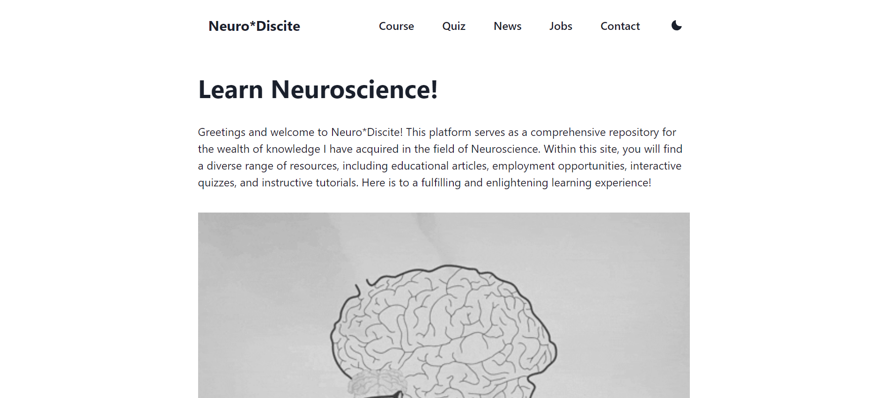

# Welcome to Neurodiscite!

## 💡 Motivation 

I was interested in creating a space where other students could learn about neuroscience. I went with building the frontend with Next.js and Chakra UI. I also wanted to start learning about Supabase, so I chose to integrate it with a Supabase database. I learned a lot about using Supabase, performing web scraping, and handling state. 

Feel free to [reach out](https://abneuro.vercel.app/contact) to me if you have any additional questions. There are lots of features that still need to be implemented!

## Important Files

- `Quiz.js`: Implementation of the quiz.
- `Jobs.js`: Fetching job postings.
- `News.js`: Connected to News API.

## ✨ Pages 

1. **Home Page**: <br/>
 

2. **Register Page**: <br/>
 

3. **Dashboard Page**: <br/>
 

4. **Login Page**: <br/>
 

5. **Buy Page**: <br/>
 

5. **Transaction Page**: <br/>
 

## ⚡️ Technologies 

This site was built using Flask and MySQL. 

The Neurocoin System allows users to manage a blockchain-based ledger of transactions for a token system. Users can register, log in, view their account balance, send tokens to other users, and empty their account.

**Here is a simple diagram showing how databases can be connected to a Next.js web app:**

 

### Features
- Quiz application
- Job Postings
- Neuroscience Courses

### Important Dependencies
- Chakra UI
- Supabase

## Future Improvements
1. Add user authentication. 
2. Scrape more job sites for science related jobs.

## 👏 Contribute 

Contributions are welcome as always. Before submitting a new pull request, please make sure to open a new issue.

This is a [Next.js](https://nextjs.org/) project bootstrapped with [`create-next-app`](https://github.com/vercel/next.js/tree/canary/packages/create-next-app).

## Getting Started

First, run the development server:

```bash
npm run dev
# or
yarn dev
```

Open [http://localhost:3000](http://localhost:3000) with your browser to see the result.

## Deploy on Vercel

The easiest way to deploy your Next.js app is to use the [Vercel Platform](https://vercel.com/new?utm_medium=default-template&filter=next.js&utm_source=create-next-app&utm_campaign=create-next-app-readme) from the creators of Next.js.

Check out our [Next.js deployment documentation](https://nextjs.org/docs/deployment) for more details.
